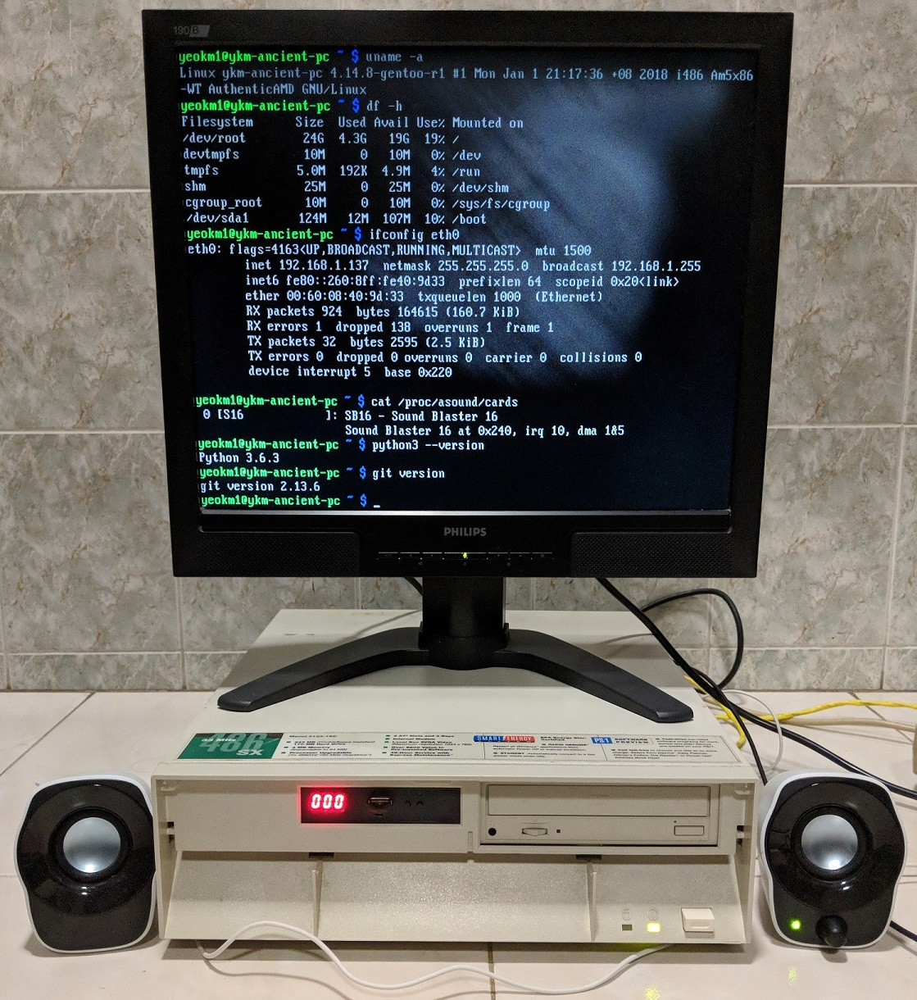
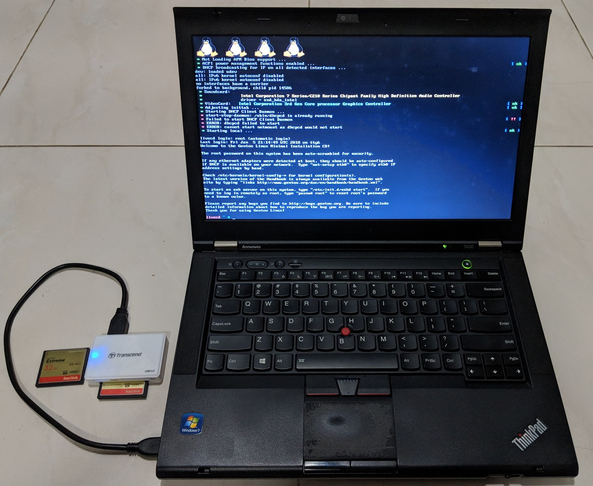

# gentoo-on-486
Instructions on how to install modern Gentoo Linux on ancient 486-based PCs. This is for a command-line install only.

As Gentoo is a source-based distribution, we have to compile every package we install from scratch including the kernel and bootloader.

This is too time-consuming to do on the 486 PC so I use a modern machine to do the compilation then move the disk over to the ancient PC.

I have written a [companion blog post](http://yeokhengmeng.com/2018/01/make-the-486-great-again/) that explains the motivations and less-technical details.

## The Hardware

### Deployment machine : [IBM PS/1 Consultant 2133 19C](https://en.wikipedia.org/wiki/IBM_PS/1) (released in 1993)



* AMD 5X86 486-clone running at 133mhz (similar performance to Pentium 75Mhz)
* Cirrus Logic VLB CL-GD5424 Graphics 512KiB VRAM
* 64MB SDRAM
* 48x IDE CD ROM Drive
* [Gotek 1.44MB floppy emulator](https://www.philscomputerlab.com/gotek-floppy-emulator.html)
* CompactFlash-IDE adapter + 32GB Sandisk Extreme CF card
* 10Mbps 3Com Etherlink III [3c509B](https://en.wikipedia.org/wiki/3Com_3c509) (ISA)
* [Sound Blaster 16](https://en.wikipedia.org/wiki/Sound_Blaster_16) CT2950 PnP (ISA) Unfortunately, this card uses [CQM](https://en.wikipedia.org/wiki/Sound_Blaster_16#OPL-3_FM_and_CQM_Synthesis_options).
* 1x Parallel Port
* 2x Serial Port
* 1x VGA port

### Compilation machine: [Thinkpad T430](http://www.thinkwiki.org/wiki/Category:T430) (released in 2012)



* Intel Core i7-3520M (3.50 GHz, 4MB L3, 1333MHz FSB)
* Intel HD Graphics 4000
* 16GB DDR3 - 1600MHz
* Gigabit Ethernet
* Ultrabay DVD-RW
* 2x USB 3.0, 2x USB 2.0
* USB-CF adapter to compile on CF card
* SSD removed to avoid corrupting it by accident during install

### (Optional) Machine to issue SSH commands to compilation machine

This can be any machine capable of SSH. This will be explained later.

## Instructions

I heavily reference official [Gentoo Wiki x86 handbook](https://wiki.gentoo.org/wiki/Handbook:X86) with some tweaks to suit the 486 as well as ease of repeated builds. Please note that my instructions are a compliment and are not a replacement to the official guide.

### 1. Preparing the install media/disks

[Gentoo Wiki: Choosing the media](https://wiki.gentoo.org/wiki/Handbook:X86/Installation/Media)

I use a CompactFlash card as my hard disk for my 486 PC to make it easy to transfer the image back and forth between it and the compilation PC.

Download the x86 Minimal Installation CD ISO image from [official download page](https://www.gentoo.org/downloads/). You can burn the ISO image to CD or to a USB flash drive but I opt for the former for simplicity.

Once you are done, boot from the install media using your modern compilation machine. You might have to adjust your BIOS settings to do so.

### 2. Networking and SSH

[Gentoo Wiki: Configuring the network](https://wiki.gentoo.org/wiki/Handbook:X86/Installation/Networking)

The official guide included quite a bit of information on setting things up.

For my case, I used a wired LAN with DHCP and everything just worked on boot. If you need a special configuration, consult that guide.

I highly recommend that you turn on SSH at this point so you can copy-paste the commands to run instead of manually typing in the commands. You can even do additional configuration while the packages are compiling.

```bash
passwd root
New Password: blahblah
Again: blahblah

/etc/init.d/sshd start
ifconfig
```
Use the third machine and `ssh root@X.X.X.X`

### 3. Preparing the disks

[Gentoo Wiki: Preparing the disks](https://wiki.gentoo.org/wiki/Handbook:X86/Installation/Disks)

The guide suggests 4 partitions with the first one being for the BIOS boot partition for EFI systems. Since our 486 obviously predates EFI, I opt to ignore that and use the following layout instead.

| Partition     | Filesystem | Size         | Description |
| ------------- | ---------- | ------------ | ----------- |
| /dev/sda1	    | ext2 	     | 128M        	| Boot        |
| /dev/sda2	    | (swap) 	   | 2048M	       | Swap        |
| /dev/sda3	    | ext4 	     | Rest of disk | Root        |

Just a note, ancient PCs have a [504MiB barrier](http://www.pcguide.com/ref/hdd/bios/sizeMB504-c.html). This means that the boot partition should reside entirely within this limit to be bootable. Once Linux is started, it can recognise the entire disk.

I created my partitions using the `fdisk` tool. Note for the `swap` partition, you have to set the partition type. Type `t` to set the partition type, `2` to select the partition just created and then type in `82` to set the partition type to "Linux Swap".

 Once done, format the partitions:

```bash
mkfs.ext2 /dev/sda1
mkswap /dev/sda2
swapon /dev/sda2
mkfs.ext4 /dev/sda3

mount /dev/sda3 /mnt/gentoo
```

### 4. Installing stage3

[Gentoo Wiki: Installing Stage 3](https://wiki.gentoo.org/wiki/Handbook:X86/Installation/Stage)

`stage3` contains almost all the files to create a bare minimum system.

```bash
date
# If date is wrong, use ntpd to update your PC's clock.
ntpd -q -g
```

Download the latest i486 stage3 tarball which at the time of writing is named `stage3-i486-20171212T011501Z.tar.bz2`. I highly recommend downloading from a mirror close to you instead of using the official one.

```bash
cd /mnt/gentoo
wget http://gentoo.aditsu.net:8000/releases/x86/autobuilds/current-stage3-i486/stage3-i486-20171212T011501Z.tar.bz2

# Untar the tarball. If you wish, you can add the `v` verbose option.
tar xjpf stage3-i486-20171212T011501Z.tar.bz2 --xattrs --numeric-owner
```

The guide says you should edit the `/mnt/gentoo/etc/portage/make.conf` and adjust the *CFLAGS* and *CXXFLAGS* to suit your system. However for this case, we can skip this as the default is already the 486. But do verify just in case.

```
CFLAGS="-O2 -march=i486 -pipe"
CHOST="i486-pc-linux-gnu"

MAKEOPTS="-j5" # A good choice is the number of CPU cores in the system plus 1
USE="-kde -qt4 -qt5 ffmpeg mp3 alsa"
```
If you want to, you can add the `MAKEOPTS` setting to benefit the compilation machine. The optional USE flags is to remove unwanted GUI support as well as add some audio support when compiling. MP3 support is extremely poor due to the slow processor speed, but you can give it a shot.


### 5. Installing base system

[Gentoo Wiki: Installing base system](https://wiki.gentoo.org/wiki/Handbook:X86/Installation/Base)

Just run the following commands I lifted from the guide.

```bash
mirrorselect -i -o >> /mnt/gentoo/etc/portage/make.conf
# To avoid having to run mirrorselect manually in your next build, you can save your list and add it next time.
# GENTOO_MIRRORS="http://gentoo.aditsu.net:8000/ http://ftp.iij.ad.jp/pub/linux/gentoo/ http://ftp.jaist.ac.jp/pub/Linux/Gentoo/ http://ftp.daum.net/gentoo/ http://ftp.kaist.ac.kr/pub/gentoo/ http://ftp.lanet.kr/pub/gentoo/ http://ftp.twaren.net/Linux/Gentoo/"

mkdir --parents /mnt/gentoo/etc/portage/repos.conf
cp /mnt/gentoo/usr/share/portage/config/repos.conf /mnt/gentoo/etc/portage/repos.conf/gentoo.conf
cp --dereference /etc/resolv.conf /mnt/gentoo/etc/

mount --types proc /proc /mnt/gentoo/proc
mount --rbind /sys /mnt/gentoo/sys
mount --make-rslave /mnt/gentoo/sys
mount --rbind /dev /mnt/gentoo/dev
mount --make-rslave /mnt/gentoo/dev

chroot /mnt/gentoo /bin/bash
source /etc/profile
export PS1="(chroot) ${PS1}"

mkdir /boot # This can be ignored as it seems to exist already
mount /dev/sda1 /boot
emerge-webrsync
```

#### Read the news
```bash
eselect news list
eselect news read
```

### Set system profile

At time of writing, there a 2 sets of profiles `13` and `17` with the former being the default for the old x86 install CD. We should use the newer profile 17 going forward.

Changing system profiles will invoke a long compilation process especially for `GCC`, to save time, you can skip this step for your initial test builds.

```bash
eselect profile list

# Set to profile "default/linux/x86/17.0" which is the 10th profile at time of writing
eselect profile set 10
# If profile change is required, run the following:
emerge --ask --update --deep --newuse @world
```

### Configure timezone

```bash
ls /usr/share/zoneinfo # To see available locales
echo "Asia/Singapore" > /etc/timezone
emerge --config sys-libs/timezone-data
```

### Configure locale

```bash
nano -w /etc/locale.gen
#Adjust your locale settings

locale-gen

eselect locale list
eselect locale set 4 # Change 4 to the one you prefer. Use the one with UTF
env-update && source /etc/profile && export PS1="(chroot) $PS1"
```

### 6. Configuring the kernel

[Gentoo Wiki: Configuring the kernel](https://wiki.gentoo.org/wiki/Handbook:X86/Installation/Kernel)

The wiki suggest using `genkernel` tool. It does not seem to work for the 486 setting so we must use the manual configuration method.

#### Find out system specs

`pciutils` entirely optional especially since my system does not have PCI bus.

```bash
emerge sys-apps/pciutils sys-apps/lshw
```

#### Just take the latest stable kernel

```bash
emerge sys-kernel/gentoo-sources
```

#### Download a particular kernel version

I decided to use the 4.14.x kernel release as the previous stable 4.12.x is rather old by now. However 4.14 is not marked stable, see this [issue](https://archives.gentoo.org/gentoo-dev/message/57f754009e47732a56bb2e0259f2ac3e).

```bash
emerge --ask =sys-kernel/gentoo-sources-4.14.8-r1 # Then make the config file changes
dispatch-conf # Press 'u' to accept
emerge --ask =sys-kernel/gentoo-sources-4.14.8-r1
```

#### Kernel options

```bash
cd /usr/src/linux
make menuconfig
```
Kernel options I used on top of the default. It might differ for your setup. I chose to compile everything into the kernel instead of using modules.

I enable traditional options as well as some modern ones as so the kernel can still work with my modern machine if I need to compile new packages in future.

##### 64-bit Kernel
* Uncheck this!!!

##### Processor type and features:
* Uncheck "Symmetric multi-processing support"
* Processor Family - Check 486
* Check Generic x86 support

##### Bus Options
* Check ISA support
*	* Check EISA support (EISA support is actually unnecessary through as my machine does not have EISA slots)
* * * Check everything here except "Generic PCI/ISA bridge" as my IBM PS/1 does not have PCI slots

##### Device Drivers
* Plug and Play support
* * ISA Plug and Play support
* * Plug and Play BIOS support
* SCSI device support
* * SCSI disk support
* SATA and PATA drivers
* * Generic ATA support
* * Legacy ISA PATA support (Experimental)
* Network device support
* * Ethernet driver support
* * * 3Com devices
* * * * 3c509/3c579 "Etherlink III" support
* Sound card support
* * ALSA
* * * ISA sound devices
* * * *  Check SB16 (PnP)
* USB Support
* * xHCI HCD (USB 3.0) Support
* * * Generic xHCI driver for a platform device
* * USB Mass Storage support
* * * Tick everything related to cards and bridges
* MMC/SD/SDIO card support

##### File Systems
* Enable all Ext2 and Ext4 relevant options
* CD-ROM/DVD Filesystems
* * Tick all
* DOS/FAT/NT Filesystems
* * Tick the NTFS options
* Network File Systems
* * SMB3 and CIFS support
* * * Tick relevant sub options

#### Backup kernel configuration

To make it easier to do subsequent rebuilds, you might want to backup the current configuration. Once you do so, you just have to upload `.config` and don't have to run `make menuconfig`.

```bash
# Backup
scp root@X.X.X.X:/mnt/gentoo/usr/src/linux/.config .

# Put back
scp .config root@X.X.X.X:/mnt/gentoo/usr/src/linux/
```

#### Compiling the kernel
```bash
make -j5 #Replace 5 with num CPU cores + 1
make modules_install
make install

# This is entirely optional for such an old system but might be useful for your compilation machine
emerge sys-kernel/linux-firmware
```

### 7. Configuring the system

[Gentoo Wiki: Configuring the system](https://wiki.gentoo.org/wiki/Handbook:X86/Installation/System)

I only adjust a subset of the settings in the guide that are relevant to me.

#### Configuring /etc/fstab
```bash
nano -w /etc/fstab

# Those are my settings based on my partition layout above
/dev/sda1   /boot        ext2    defaults,noatime     0 2
/dev/sda2   none         swap    sw                   0 0
/dev/sda3   /            ext4    noatime              0 1
/dev/cdrom  /mnt/cdrom   auto    noauto,user          0 0
```
#### Set hostname
```bash
nano -w /etc/conf.d/hostname
hostname="tux"
```
#### Network info
```bash
emerge --noreplace net-misc/netifrc

nano -w /etc/conf.d/net

# Replace eth0 with the actual network interface name. Use `ifconfig` to check.
# You can put multiple as well to easily transit between the compilation and 486 PC.
# eth0 is used by my 3Com NIC in the 486 PC
# enxxxx is used by my compilation machine

config_eth0="dhcp"
config_enxxxx="dhcp"
## End

cd /etc/init.d

ln -s net.lo net.eth0
rc-update add net.eth0 default

ln -s net.lo net.enxxxx
rc-update add net.enxxxx default
```

#### System config

```bash
# Set root password
passwd

nano -w /etc/conf.d/hwclock
# Set local clock instead of UTC if you wish
clock="local"
```

### 8. Installing tools

[Gentoo Wiki: Installing tools](https://wiki.gentoo.org/wiki/Handbook:X86/Installation/Tools)


#### Required installs

```bash
# Install system logger
emerge app-admin/sysklogd
rc-update add sysklogd default

# Install cron daemon
emerge sys-process/cronie
rc-update add cronie default

# Install file indexing tools
emerge sys-apps/mlocate

# Start SSH on boot
rc-update add sshd default

# Install file systems tools
emerge sys-fs/e2fsprogs sys-fs/dosfstools

# Install DHCP
emerge net-misc/dhcpcd

# NTP
emerge net-misc/ntp

# If ALSA is enabled in the USE flags
emerge media-libs/alsa-lib
emerge media-sound/alsa-utils
rc-update add alsasound boot

# If FFmpeg is enabled in the USE flags
emerge media-video/ffmpeg
```

#### Correct syslog issues

I tested after reboot, I got `No such file or directory` errors on some files. Since I do not need them, I just made the following changes.

```bash
nano /etc/syslog.conf

# Comment out the following lines
#news.crit                       /var/log/news/news.crit
#news.err                        /var/log/news/news.err
#news.notice                     -/var/log/news/news.notice

# Change
*.=notice;*.=warn	|/dev/xconsole
# to
*.=notice;*.=warn	|/dev/tty6 # Or any other tty since I don't use xconsole on my system.
```

#### Optional installs
Note that the following may take a significant amount time to compile.

```bash
emerge sys-apps/hwinfo
emerge www-servers/nginx
emerge dev-vcs/git
emerge media-sound/moc

# Golang only works for Pentium MMX CPUs and up. But you can install this to see the failure message for fun.
emerge dev-lang/go

# Gentoo's default Python version is only 3.5 at time of writing. You can install Python 3.6 but Portage and others will still remain on Python 3.5.
emerge dev-lang/python:3.6
```

### 9. Configuring the bootloader

[Gentoo Wiki: Configuring the bootloader](https://wiki.gentoo.org/wiki/Handbook:X86/Installation/Bootloader)

#### Install Bootloader

In theory, one should use the modern Grub2 bootloader. Grub2 loads ok but the system reboots the moment I select a boot option. This seems like a known issue given the age of the system. So I use the older LILO instead.

```bash
emerge sys-boot/lilo
```
#### Configure LILO

Adjust the kernel version to suit yours

```bash
nano -w /etc/lilo.conf
### Add the following
boot=/dev/sda             # Install LILO in the MBR
prompt                    # Give the user the chance to select another section
timeout=50                # Wait 5 (five) seconds before booting the default section
default=gentoo            # When the timeout has passed, boot the "gentoo" section

image=/boot/vmlinuz-4.14.8-gentoo-r1
  label=gentoo
  read-only
  root=/dev/sda3
  vga=4                   # This will set the VGA mode to 80x30

image=/boot/vmlinuz-4.14.8-gentoo-r1
  label=gentoo-ask-vga
  read-only
  root=/dev/sda3
  vga=ask                 # Linux will ask you to pick the VGA mode on startup

image=/boot/vmlinuz-4.14.8-gentoo-r1
  label=gentoo-rescue
  read-only
  root=/dev/sda3
  append="init=/bin/bb"
### End

/sbin/lilo
```

### 10. Finalising install

[Gentoo Wiki: Finalizing](https://wiki.gentoo.org/wiki/Handbook:X86/Installation/Finalizing)

#### Create non-root user
```bash
#Add non-root user. By default, you cannot SSH in as root user.
useradd -m -G users,wheel,audio -s /bin/bash john
passwd john
```

#### Unmount and reboot/poweroff system
```bash
exit
cd
umount -l /mnt/gentoo/dev{/shm,/pts,}
umount -R /mnt/gentoo

reboot # This is preferred so the SSH keys can be generated for the first time on your compilation machine instead of taking like ages on the 486 PC.
poweroff
```

For some strange reason, I cannot reliably boot with a USB-CF card adapter. Subsequent powerups on my Thinkpad sometimes fail. Booting up with a native SATA-CF adapter works fine. See the bonus step.

### 11. Boot on i486

Transfer the disk to the 486 PC and hope it boots! Very slowly.... but it'll work. Good luck!

All commands below except ALSA stuff are only usable if you are the `root` user but I'm sure you can find a way to solve that. You also cannot SSH in via the root user by default.

#### Change preferred Python version

If you installed another Python version earlier.

```bash
eselect python list
# Select your preferred Python version
eselect python set 2
```

#### Update time
Just in case...

```bash
ntpd -q -g
```

#### Sound test
If you want to test the sound, you can run the following commands:

```bash
alsamixer # Remember to increase PCM volume
speaker-test -t wav -c 2
```

#### Configure Web Server

If you installed `nginx` earlier, you can try your hand at hosting something. [Reference](https://wiki.gentoo.org/wiki/Nginx)

```bash
mkdir /var/www/localhost/htdocs
# Create a dummy page
echo 'Hello, world!' > /var/www/localhost/htdocs/index.html
nano /etc/nginx/nginx.conf
# Change `listen 127.0.0.1;` -> `listen 0.0.0.0;`

/etc/init.d/nginx start

# Start on boot
rc-update add nginx default
```

### Bonus step:

If for some reason you need to rescue the Gentoo installation (say if kernel fails), you can try booting up from the install CD and mount the disk instead of installing from scratch. These are the instructions you can use based on above:

```bash
# These are if you want to SSH into the system
passwd root
New Password: blahblah
Again: blahblah

/etc/init.d/sshd start
ifconfig
#

mount /dev/sda3 /mnt/gentoo

mount --types proc /proc /mnt/gentoo/proc
mount --rbind /sys /mnt/gentoo/sys
mount --make-rslave /mnt/gentoo/sys
mount --rbind /dev /mnt/gentoo/dev
mount --make-rslave /mnt/gentoo/dev

chroot /mnt/gentoo /bin/bash
source /etc/profile
export PS1="(chroot) ${PS1}"

mkdir /boot # This can be ignored as it seems to exist already
mount /dev/sda1 /boot
```
